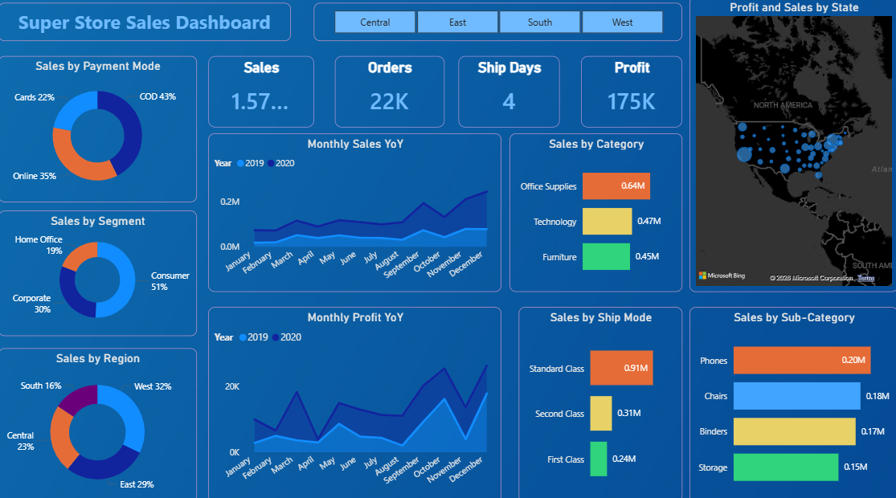
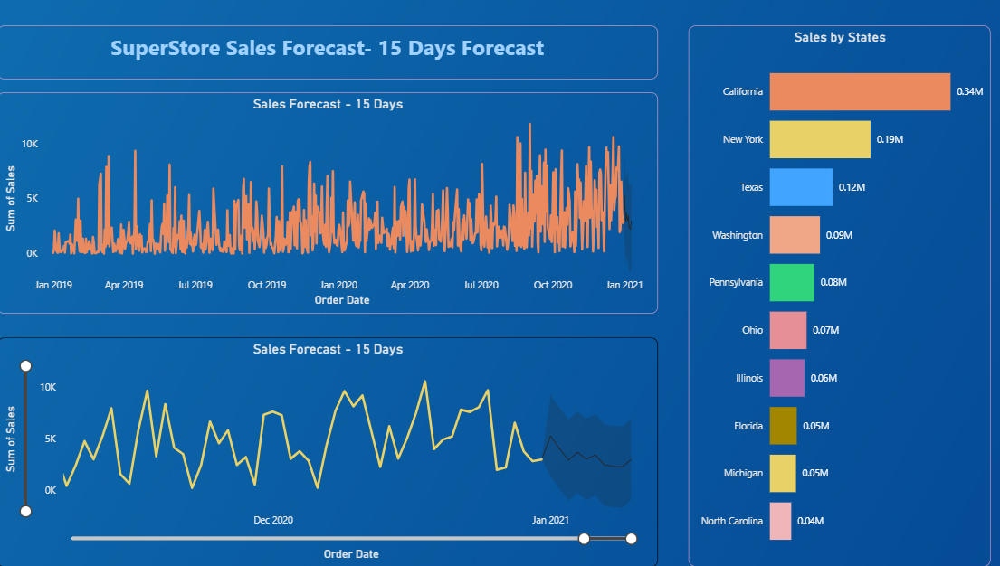

# Super-Store-Sales-Dashboard-PowerBI
Interactive sales dashboard built in Power BI analyzing revenue, trends, and regional performance.

📊 Super Store Sales Dashboard using Power BI
-
📌 Project Overview
-
This project analyzes a retail Super Store dataset using Microsoft Power BI to extract performance insights and build an interactive multi-page dashboard with a 15-day sales forecast.

🧩 Business Problem
-
A retail Super Store operates across multiple regions, segments, and product categories in the USA. The business faces a critical strategic question:
How should the Super Store optimize its sales, profitability, and fulfillment operations to maximize revenue and reduce margin leakage?
Currently, decisions are made without clear visibility into:

Which categories and sub-categories drive sales vs. which drain profit
Which states and regions are underperforming relative to their potential
Whether shipping and payment choices are eroding margins
What near-term demand looks like over the next 15 days

👉 Without this analysis, the business risks over-investing in low-margin segments, misallocating logistics spend, and reacting to demand instead of anticipating it.

🎯 Objective
-
The objective of this project is to:

**Track core KPIs:** Sales, Orders, Profit, and Average Ship Days
Analyze performance by Category, Sub-Category, Segment, Region, State, Ship Mode, and Payment Mode
Compare Month-over-Month and Year-over-Year trends in Sales and Profit
Build a 15-Day Sales Forecast to support short-term operational planning
Deliver actionable recommendations, not just descriptive charts

🛠️ Tools Used

Microsoft Power BI
DAX (Data Analysis Expressions)
Power BI Native Forecasting
Data Modeling & Relationships
Interactive Slicers & Cross-filtering

📸 Dashboard Preview

Page 2 — Sales Forecast 

🔍 Key Insights
--
💰 Sales & Profitability
--
Sales are unevenly distributed across product categories, with 1–2 dominant categories likely accounting for the majority of revenue. However, high sales do not always correspond to high profit — certain categories generate significant revenue while delivering thin or negative margins.

👉Interpretation: The business has a revenue concentration problem. If the top category faces demand softening, the overall business is disproportionately exposed.

🚚 Shipping & Fulfillment:
-
Ship Mode analysis reveals how fulfillment choices impact the bottom line. Expedited shipping modes (Same-Day, First Class) inflate fulfillment costs even when customers don't explicitly request them — the default ship mode choice alone can account for meaningful margin erosion.

👉 Interpretation: Fulfillment cost is a controllable margin lever that is likely being treated as a fixed expense rather than an optimization opportunity.

🗺️ Geographic Performance
-
The state-level map shows a clear divide between high-sales/high-profit states and "busy but unprofitable" states — markets consuming logistics, support, and marketing resources without delivering proportional returns.

👉 Interpretation: Not all geographies deserve equal investment. Some states need pricing correction; others may need demand-generation investment; a few may not justify continued resource allocation at current margins.

👥 Segment & Payment Analysis
-
Customer segment distribution and payment mode breakdown together reveal where trust barriers exist. A high share of COD (Cash on Delivery) orders in certain segments signals friction in the purchase journey — not a pricing issue, but a trust and UX issue.

👉 Interpretation: Converting COD customers to prepaid directly reduces return-related losses, improves cash flow predictability, and is a higher-ROI lever than acquisition spend.

📅 Seasonality & Trends
-
Monthly YoY charts in both Sales and Profit reveal consistent seasonal patterns. Most businesses treat these charts as historical records. The real value is forward-looking — the peaks and troughs of last year are the best predictor of this year's rhythm.

👉 Interpretation: This data contains operational planning intelligence that is currently being read as history rather than used as a forecast.

💡 Business Recommendations
-

🗺️ Geographic Investment Strategy
-
For the bottom 5 states: evaluate whether the issue is pricing, product mix, or acquisition cost
Reduce paid acquisition spend in states where margin is structurally negative

👉 Goal: Reallocate geographic investment toward markets with positive margin momentum

💳 Payment & Trust Strategy
-
Identify the top 3 COD-heavy regions/segments
A/B test a prepaid discount incentive (e.g., 2–3% off for prepaid orders)
Track conversion rate and return rate as dual success metrics

👉 Goal: Convert COD volume to prepaid to reduce reverse logistics cost and improve cash flow

📅 Demand Forecasting
-
Use the YoY seasonal patterns to build a 90-day forward inventory and staffing model
Annotate the 15-day forecast chart with the promotions calendar to convert a statistical prediction into an operational planning tool

👉 Goal: Shift from reactive to anticipatory operations management

🌍 Strategic Summary
-
This dashboard reveals that the Super Store's growth challenge is not primarily an acquisition problem it is a margin optimization and operational efficiency problem.
The business needs a dual strategy:

Protect and optimize existing high-performing segments, geographies, and categories
Fix the leaks in fulfillment cost, geographic margin, and payment friction before scaling further

👉 A data-driven operational strategy can help the Super Store move from chasing top-line revenue to building sustainable, profitable growth.

🚀 Impact of This Project
-
**This project demonstrates:**

Business problem framing and hypothesis-driven analysis
KPI framework design and Power BI report architecture
Geographic and segmentation analysis
Forecasting integration in a BI context
Translating visual data into strategic business recommendations

🎯 Dashboard Features
-

✅ Interactive Region slicer driving all 15 visuals simultaneously

✅ KPI cards: Total Sales, Orders, Profit, Avg. Ship Days

✅ Year-over-Year comparison via stacked area charts

✅ Geographic profit/sales map with state-level granularity

✅ Native Power BI 15-day sales forecast with trend line

✅ Multi-dimension breakdown: Category, Sub-Category, Segment, Ship Mode, Payment Mode, Region

📂 Files Included
-
📁 SuperStore-Sales-Dashboard/

Sales_Dashboard.pbix → Complete Power BI project file

dashboard_page1.png → Executive overview dashboard screenshot

dashboard_page2.png → Forecast & state breakdown screenshot

README.md → This file

Dashboard screenshots → Visual preview  

🚀 How to Use
-
Download Sales_Dashboard.pbix

Open in Microsoft Power BI Desktop 

Use the Region slicer on Page 1 to filter all visuals by geography

Navigate to Page 2 for the 15-day sales forecast and state-level breakdown

Hover over map bubbles for Profit + Sales tooltips by state

